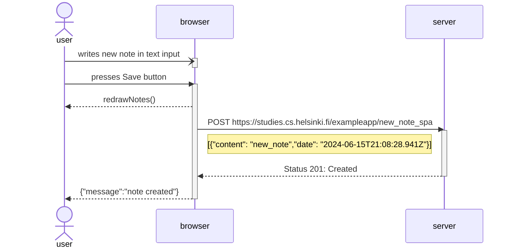

# 0.6: New note on SPA diagram 

```mermaid

sequenceDiagram

    actor user
    participant browser
    participant server

    user-)browser: writes new note in text input
    activate browser
    deactivate browser
    user->>browser: presses Save button
    activate browser   
    browser-->>user: redrawNotes()
    browser->>server: POST https://studies.cs.helsinki.fi/exampleapp/new_note_spa
    activate server
    Note right of browser: [{"content": "new_note","date": "2024-06-15T21:08:28.941Z"}]
    
    server-->>browser: Status 201: Created
    deactivate server
    browser-->>user: {"message":"note created"} 
    deactivate browser
```